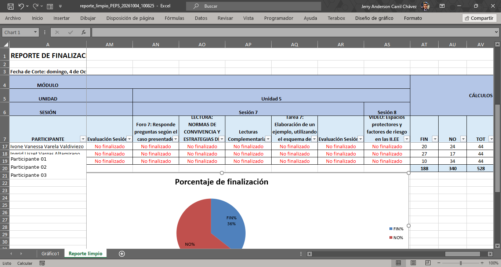
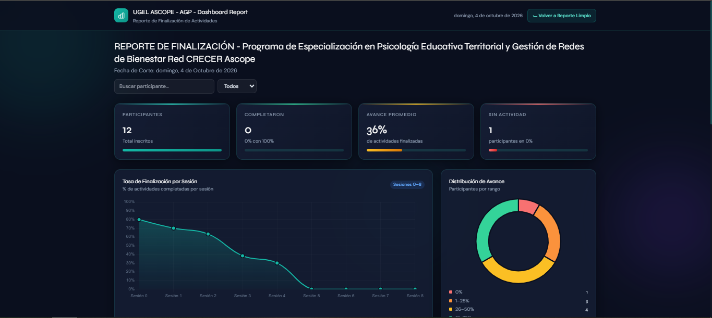
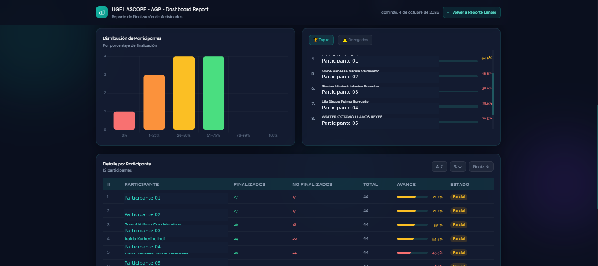
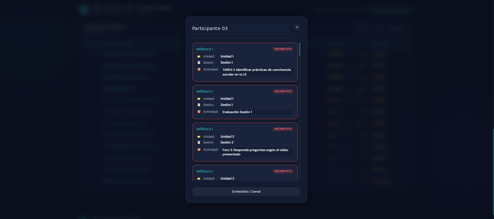
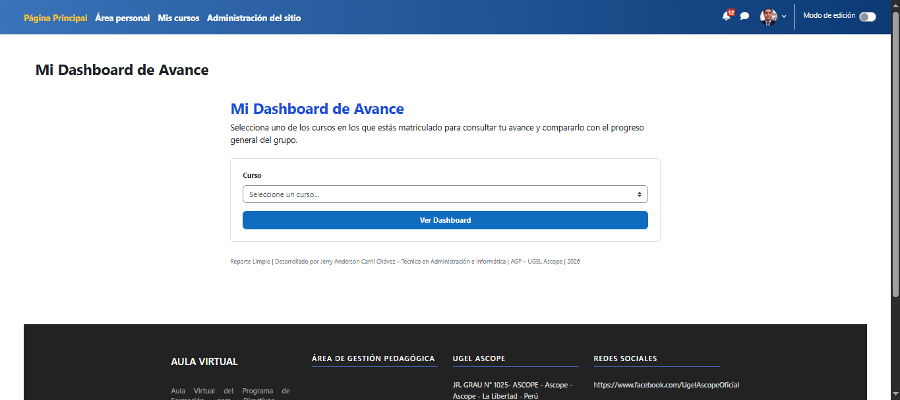
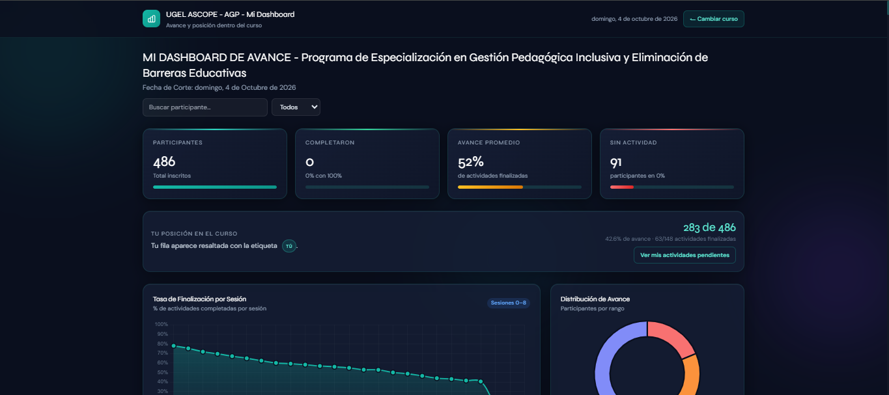
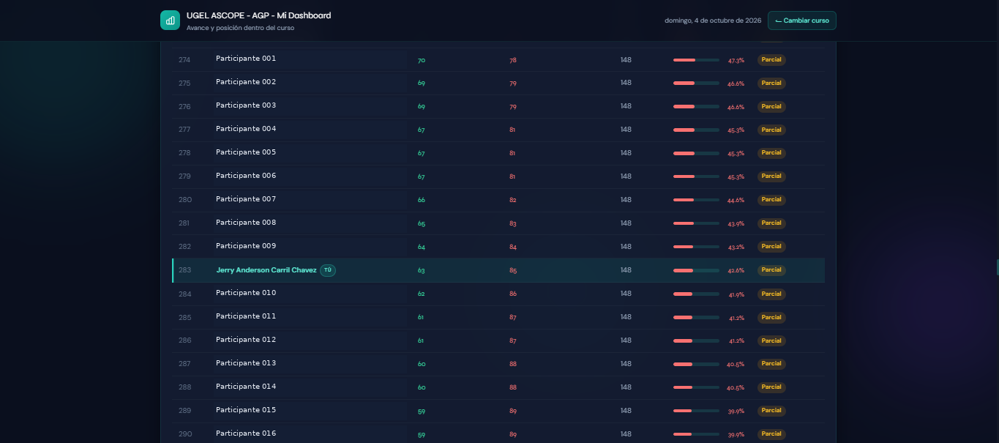
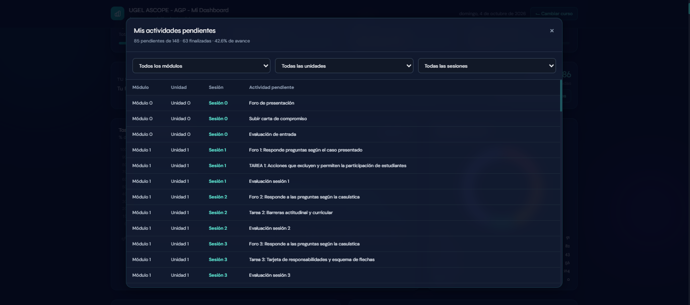

# Moodle-Reporte-Limpio

Plugin para **Moodle** orientado a la generación, procesamiento y visualización de reportes de finalización de actividades. Integra exportación a Excel, detección jerárquica de contenidos y dashboards de seguimiento para administradores y participantes.

**Desarrollador:** Jerry Anderson Carril Chávez  
**Cargo:** Técnico en Administración e Informática  
**Área:** AGP – UGEL Ascope  
**Versión estable:** 0.6.8  
**Año:** 2026  
**Licencia:** MIT

## Origen del proyecto

El proyecto nació ante la necesidad de mejorar el seguimiento de los participantes de programas de formación gestionados mediante Moodle. Los reportes de finalización exportados por la plataforma contenían la información necesaria, pero requerían limpieza, reorganización y cálculos adicionales antes de poder utilizarlos para el seguimiento.

La solución evolucionó en tres etapas principales:

### 1. Automatización con Python

La primera solución consistió en una aplicación en Python para procesar automáticamente los reportes exportados desde Moodle. Permitió limpiar y reorganizar la información, consolidar actividades, calcular estados de finalización y generar indicadores como **FIN, NO, TOT, FIN% y NO%**.

Posteriormente se incorporó la identificación de la estructura pedagógica:

`Módulo → Unidad → Sesión → Actividad`

Esto permitió transformar el reporte original en información más útil para el seguimiento académico.

### 2. Dashboard con JavaScript

La segunda etapa incorporó un dashboard interactivo desarrollado con tecnologías web para visualizar los resultados de forma más rápida. Se añadieron indicadores, gráficos, búsqueda de participantes, filtros por porcentaje de avance, ranking y visualización de participantes con mayor o menor progreso.

### 3. Integración como plugin PHP para Moodle

Finalmente, la solución se integró directamente en Moodle mediante un plugin local desarrollado principalmente en PHP, complementado con JavaScript, HTML y CSS. De esta manera, el procesamiento y la visualización dejaron de depender exclusivamente de herramientas externas.

El plugin permite generar el reporte Excel, consultar el dashboard administrativo y proporcionar a cada participante un dashboard personal según sus cursos y matrícula activa.

## Funcionalidades principales

- Generación de reportes de finalización en Excel.
- Detección jerárquica de módulos, unidades y sesiones.
- Consolidación de actividades duplicadas según la lógica del reporte.
- Estados **Finalizado** y **No finalizado** con diferenciación visual.
- Cálculos automáticos de FIN, NO, TOT, FIN% y NO%.
- Gráfico global de finalización.
- Dashboard administrativo integrado.
- Búsqueda y filtros por nivel de avance.
- Ranking de participantes.
- Dashboard personal del participante.
- Visualización de posición dentro del curso.
- Consulta de actividades pendientes propias.
- Filtros de pendientes por módulo, unidad y sesión.
- Protección mediante autenticación y matrícula activa.

## Tecnologías utilizadas

- PHP
- JavaScript
- HTML / CSS
- Moodle API
- PHPSpreadsheet / herramientas de exportación de Moodle
- Chart.js
- Tailwind CSS (interfaz del dashboard)
- Python y openpyxl en la etapa inicial de automatización
- Microsoft Excel como formato de salida del reporte

## Flujo de la solución

`Moodle → procesamiento y consolidación → reporte Excel → dashboard administrativo / dashboard del participante`

La evolución histórica del proyecto fue:

`Reporte Moodle → Python → Dashboard JavaScript → Plugin PHP integrado en Moodle`

## Dashboard del participante

El participante autenticado puede seleccionar uno de los cursos en los que mantiene una matrícula activa y consultar:

- porcentaje de avance;
- actividades finalizadas y pendientes;
- posición dentro del curso;
- ranking general;
- actividades pendientes organizadas por módulo, unidad y sesión.

Los detalles de las actividades pendientes de otros participantes no se muestran.

## Instalación

1. Copiar la carpeta del plugin como `reportelimpio` dentro de `local/` en la instalación de Moodle.
2. Ingresar a Moodle como administrador.
3. Acceder a **Administración del sitio → Notificaciones**.
4. Completar la instalación/actualización del plugin.
5. Configurar los permisos necesarios según los roles utilizados en la plataforma.

> Se recomienda probar primero el plugin en un entorno de pruebas antes de instalarlo o actualizarlo en producción.

## Evolución reciente

### V0.6.4
Corrige la búsqueda de participantes y los filtros de porcentaje de avance en los dashboards.

### V0.6.5
Corrige el cálculo y visualización de la posición del usuario autenticado dentro del curso.

### V0.6.6
Añade la consulta de actividades pendientes propias, organizadas por módulo, unidad y sesión.

### V0.6.7
Mejora el contraste y legibilidad de los filtros del modal de actividades pendientes.

### V0.6.8
Corrige el acceso de usuarios con rol Estudiante a **Mi Dashboard**, manteniendo la protección mediante inicio de sesión y matrícula activa.

## Privacidad y seguridad

El repositorio no debe incluir bases de datos, credenciales, contraseñas, tokens, archivos de configuración privados ni información personal de los participantes. Los datos mostrados por el plugin se obtienen desde la instalación Moodle donde se ejecuta.

## 📸 Capturas del sistema

Las siguientes capturas muestran el funcionamiento de **Reporte Limpio**, desde la generación automatizada del reporte hasta la integración de dashboards administrativos y de participantes en Moodle.

### 📊 Reporte Excel generado

El sistema organiza automáticamente las actividades según la estructura **Módulo → Unidad → Sesión**, calcula actividades finalizadas y no finalizadas y genera indicadores y gráficos de avance.

### 📈 Dashboard administrativo

Permite visualizar indicadores generales del curso, porcentaje promedio de avance, participantes sin actividad y tasa de finalización por sesión.

### 🏆 Seguimiento y ranking de participantes

El dashboard permite analizar la distribución del progreso y consultar el ranking de participantes según su porcentaje de finalización.

### 🔎 Detalle de actividades pendientes

Desde el dashboard administrativo se pueden identificar las actividades que todavía debe completar un participante, organizadas por módulo, unidad y sesión.

### 🎓 Mi Dashboard de Avance

Los participantes autenticados pueden seleccionar uno de los cursos en los que se encuentran matriculados para consultar su progreso.

### 👤 Dashboard del participante

Cada participante puede consultar su avance individual y compararlo con el progreso general del curso.

### 🥇 Posición dentro del curso

El sistema calcula la posición del participante dentro del ranking y resalta automáticamente su propia fila mediante la etiqueta **TÚ**.

### 📋 Mis actividades pendientes

El participante puede consultar exactamente qué actividades tiene pendientes y filtrarlas por **módulo, unidad y sesión**.

## 📈 Impacto
Reporte Limpio surgió para optimizar un proceso que requería aproximadamente 3 días de trabajo manual para procesar los reportes de finalización de 28 cursos en Moodle.
Con la automatización, el procesamiento se redujo a aproximadamente 1–3 minutos por curso, equivalente a unos 28–84 minutos para los 28 cursos, además de automatizar la depuración de actividades duplicadas, los cálculos de avance y la generación del reporte Excel.
Esto permitió dedicar menos tiempo al procesamiento manual y disponer de la información de seguimiento de los participantes de manera mucho más rápida.
Redujo en ~94 % el tiempo de procesamiento de 28 reportes, pasando de ~24 horas de trabajo manual (3 jornadas) a un máximo aproximado de 84 minutos.

## Autor

**Jerry Anderson Carril Chávez**  
Técnico en Administración e Informática  
AGP – UGEL Ascope  
2026

## Licencia

Este proyecto se distribuye bajo la **Licencia MIT**. Consulta el archivo `LICENSE` para más información.
